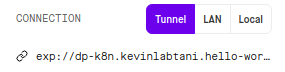
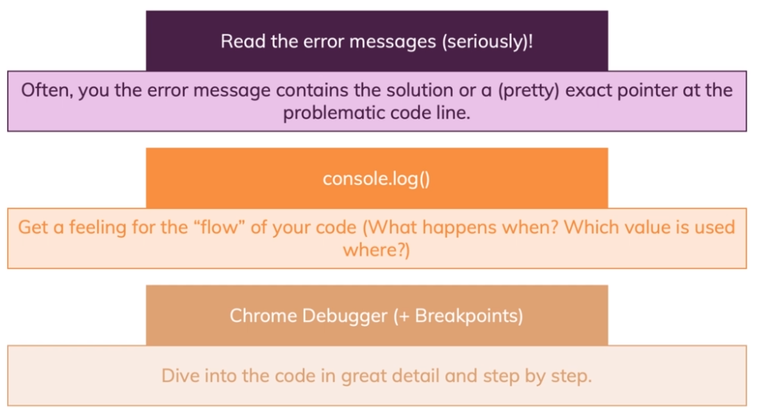

# React Native Workshop

## Getting Started

We have two options for creating a new React Native App, either **Expo CLI** or **React Native CLI**.
We'll be using the **Expo CLI** in this workshop; it's a 3rd party service that's free to use, you don't even need to sign-up!
Expo provides us with a managed app development environment, similar to create-react-app for React. The main downside with Expo is that you're limited to its ecosystem, so it's not possible to include custom native modules beyond the React Native APIs and components that are available in the Expo client app; but much like with create-react-app it'ICs possible to eject from Expo if you want to eventually create your own native build.

### Installation Steps

0. You need an up-to-date NodeJS version, but you should already have it installed, please install [NodeJS](https://nodejs.org/en/) if that's not the case.
1. Visit [Expo.io](https://expo.io/learn) and install the Expo command line tool by typing `npm install expo-cli --global` in your terminal, if you run into permissions issues install the tool with `sudo npm install expo-cli --global` instead.
   1. MacOS only: [Install Watchman](https://facebook.github.io/watchman/docs/install.html) with `brew install watchman`
1. Let's create our first project! in your terminal, navigate to a folder where you want to create the project and run `expo init hello-world`, select the template `blank - a minimal app as clean as an empty canvas` and wait for the installation to finish, then `cd hello-world` and run `npm start` to start up the expo dev tools. You will need to leave that process running in the background.
1. A tab should open in your browser at `http://localhost:19002/`, please switch to it; this is the **Expo DevTools** and it allows you to run your app on devices simulators or on connected devices. Due to network issues here at A6K you'll need to pick _tunnel_ as a connection method, please make sure the tunnel url looks like `exp://dp-k8n.kevinlabtani.hello-world.exp.direct:80` rather than `exp://192.168.1.5:19000`, if it doesn't you'll get the message _Tunnel URL not found, falled back to LAN URL._ in your console window, please stop the Expo server by typing `CTRL + C` and then restart it with `npm start`; running it as admin `sudo npm start` or forcing tunnel mode at startup with `sudo expo start --tunnel` instead might help.

   

1. The easiest way to view your project is to use your own device, for that you'll need to install the Expo Client App on your mobile phone; simply search for _Expo client_ in your app store and install it on your device. Once installed start the Expo Client (you don't need to sign up). On Android scan the QR code from the Expo App, on IOS use the Camera App and scan the QR code. On the first run it'll take some time for the JavaScript Bundle to build, don't worry, it'll be much faster on subsequent runs! If everything worked, you should see _Open up App.js to start working on your app!_

### Running the App on a Simulator (Optional)

1. Install [Android Studio](https://developer.android.com/studio) please refer to [Quentin & Jonathan tutorial](https://petroons-jonathan.github.io/flutter-app/) if you need step by step instructions.
2. Launch **Android Studio** (`./studio.sh` in terminal from the _android-studio/bin_ folder on linux)
3. 1. Click on _Configure > SDK Manager_, make sure you have one of the latest SDK installed (Android 10 or 9)
   2. Make sure you have the _Android SDK Build-Tools_, _Android Emulator_, _Android SDK Platform-Tools_, _Android SDK Tools_ and _Google Play services_ installed in the _SDK Tools_ tab. [**Click me for a picture guide**](./readme-pics/android-sdk-tools.png)
4. 1. From **Android Studio** main window, click _Configure > AVD Manager_
   2. Create a device if you don't already have one, go for the Pixel 2 and pick API Level 29
   3. Launch the emulator by clicking the green play button/
5. launch your Expo App on the emulator by going to the **Expo DevTools** window in your browser and click on _Run on Android device/emulator_

## What is React Native?

React Native is an open-source mobile application framework created by Facebook.
It is used to develop applications for Android, iOS, Web and UWP by enabling developers to use React along with native platform capabilities.
An incomplete port for Qt also exists.

Facebook released the first version for the React JavaScript Configuration in 2015.

### Differences between React.js and React Native

| React.js                                             | React Native                                                    |
| :--------------------------------------------------- | :-------------------------------------------------------------- |
|                                                      |                                                                 |
| JavaScript library;                                  | JavaScript framework;                                           |
|                                                      |                                                                 |
| create user-friendly and responsive UI components;   | build native applications (Android, iOS, Web and UWP);          |
|                                                      |                                                                 |
| uses HTML;                                           | doesn't use HTML;                                               |
|                                                      |                                                                 |
| the browser code is rendered through virtual DOM;    | uses Native API for rendering components on mobile;             |
|                                                      |                                                                 |
| uses CSS components;                                 | uses Stylesheets for building UI and do not use CSS;            |
|                                                      |                                                                 |
| CSS helps to create animations;                      | the Animated API;                                               |
|                                                      |                                                                 |
| needs third-party library tools for the dev process; | doesn’t need any third party library tools for its dev process; |

## React Native Basics

Let's go back to our Hello World App!

### Basic Components

With React Native, you can't use HTML elements (e.g. `<div>`, `<p>`, `<input>`), you use built-in components specific to React Native instead.

```js
<View style={styles.container}>
  <Text>Open up App.js to start working on your app!</Text>
</View>
```

The `<View>` component is the equivalent of a `<div>` or a `<span>` component in html, we use it to group other components together, structure them and add some container styling.

The `<Text>` component is used to output text.

You style React Native Apps by using JavaScript, all of the core components accept a `style` prop. Android & IOS devices don't support CSS, but React Native emulates the idea of CSS. You can directly pass a JavaScript object to the `style` prop, but typically you'll use the `StyleSheet` component, which is basically an abstraction similar to CSS StyleSheets and also add validation and potential performance improvements compared to passing a POJO to the `style` prop.

```js
const styles = StyleSheet.create({
  container: {
    flex: 1,
    backgroundColor: "#fff",
    alignItems: "center",
    justifyContent: "center"
  }
});
```

## Debugging React Native Apps



The best way to debug your React Native App is to use React Native Debugger.  You can find all information about this tool [on its official github page](https://github.com/jhen0409/react-native-debugger).
